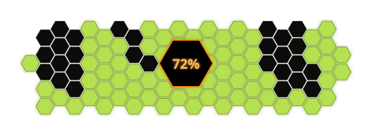

<div align="center">
  
</div>

<h1 align="center">A.T. Field Status</h1>

<p align="center">
  Evangelion-inspired hexagonal SVG progress bar generator.
  <br/>
  <em>100 hexagons. 100 percent. One A.T. Field.</em>
</p>

<p align="center">
  
  
  
  
  
</p>

<p align="center">
  <a href="#-overview">Overview</a> •
  <a href="#-features">Features</a> •
  <a href="#-installation">Installation</a> •
  <a href="#-usage">Usage</a> •
  <a href="#-project-structure">Structure</a> •
  <a href="#-license">License</a>
</p>

---

# 🎯 Overview

A.T. Field Status is an open-source SVG generator inspired by the charging screen found on the Evangelion edition of the HiBy R4.

The goal of this project is to create a highly customizable hexagonal progress indicator that can be embedded directly into GitHub repositories, websites, dashboards, or personal projects.

Each generated image contains:

- 100 hexagons representing 100%
- Filled hexagons
- Animated charging hexagons
- Empty hexagons
- A central percentage indicator
- Optional neon effects

---

# 📊 Progress



Current phase: Initial development.

---

# ✨ Features

- **SVG generation**
- **Command-line interface**
- **Animated charging effects**
- **Orbitron font support**
- **Customizable colors**
- **Seed-based deterministic patterns**
- **Neon glow effects**
- **GitHub integration**

---

# 🗺️ Roadmap

## Phase 1 — Core implementation

- [x] Define the project architecture.
- [x] Create the repository.
- [x] Design the hexagonal layout.
- [x] Implement SVG generation.
- [x] Implement the command-line interface.

---

## Phase 2 — Animations

- [x] Add charging animations.
- [x] Implement glow effects.
- [ ] Optimize rendering performance.

---

## Phase 3 — Packaging

- [ ] Create the Python package.
- [ ] Add automated tests.
- [ ] Publish documentation.

---

# 🛠️ Installation

## Clone the repository

```bash
git clone https://github.com/evan-trr/atfield-status.git
cd atfield-status
```

## Create the virtual environment

```bash
make venv
```

---

## Install using pip

```bash
pip install .
```

---

# 🚀 Usage

## Generate an SVG

```bash
atfield 42 -o progress.svg
```

---

## Customize the colors

```bash
atfield 75 \
    --filled "#00ff88" \
    --charging "#ff6600" \
    --empty "#111111"
```

---

## Disable the glow effect

```bash
atfield 50 --no-glow
```

---

## Open the file directly (macOS)

```bash
make open ARGS=50
```

---

# ⚙️ Command-line options

```text
progress                  Progress percentage (0-100)

-o, --output FILE         Output file
--count COUNT             Number of hexagons
--radius RADIUS           Hexagon radius
--gap GAP                 Hexagon spacing
--bg COLOR                Background color
--filled COLOR            Filled hexagons color
--charging COLOR          Charging hexagons color
--empty COLOR             Empty hexagons color
--stroke COLOR            Central border color
--stroke-width WIDTH      Border thickness
--seed SEED               Random seed
--no-glow                 Disable glow effect
```

---

# 📁 Project structure

```text
atfield-status/
│
├── src/
│   └── atfield/
│       ├── __init__.py
│       ├── cli.py
│       └── generator.py
│
├── tests/
│   └── test_generator.py
│
├── docs/
│   └── Nothing for now ...
│
├── assets/
│   ├── atfield-banner.svg
│   └── atfield-example.svg
│
├── pyproject.toml
├── Makefile
├── LICENSE
└── README.md
```

---

# 🧠 How it works

1. A flat-top hexagonal grid is generated.

2. The central area is removed.

3. A deterministic pseudo-random function determines the fill order.

4. Hexagons are divided into three states:
   - Filled = the same as the %
   - Charging = 10 or less hex
   - Empty = the rest

5. CSS animations are embedded directly into the SVG file.

6. The final image is exported.

---

# 🎨 Customization

## Cyberpunk 2077 theme

```bash
atfield 60 \
    --filled "#53c1e5" \
    --charging "#fee701" \
    --empty "#0a001a"
```

---

## Small badge

```bash
atfield 85 --count 30 --radius 8
```

---

# 📚 Documentation

Additional documentation can be found inside the `docs` directory.

---

# 🙏 Acknowledgements

- HiBy
- Neon Genesis Evangelion
- SVG specifications
- Python community

---

# 📄 License

MIT License.

See the [LICENSE](LICENSE) file for additional information.

---

<p align="center">
    Made by <strong>Akalice</strong>
</p>
