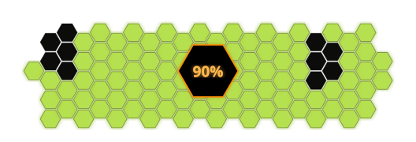

<div align="center">
  
</div>

<h1 align="center">A.T. Field Status</h1>

<p align="center">
  An Evangelion-inspired SVG progress bar generator for repositories, dashboards, and personal projects.
  <br/>
  <em>100 hexagons. One percent-driven visual system.</em>
</p>

<p align="center">
  
  
  
  
</p>

<p align="center">
  <a href="#-overview">Overview</a> •
  <a href="#-progress">Progress</a> •
  <a href="#-features">Features</a> •
  <a href="#-roadmap">Roadmap</a> •
  <a href="#-installation">Installation</a> •
  <a href="#-usage">Usage</a> •
  <a href="#-project-structure">Project structure</a> •
  <a href="#-license">License</a>
</p>

---

## Overview

A.T. Field Status is an open-source SVG generator inspired by the charging screen found on the Evangelion edition of the HiBy R4.

The project generates a highly customizable hexagonal progress indicator that can be embedded directly into GitHub repositories, websites, dashboards, or personal projects.

---

## Progress

<div align="center">
  
</div>

The current scope is complete. The project is stable, documented, and ready for regular use, with polish and future enhancements still possible.

---

## Features

- **SVG generation** - generate standalone progress visuals.
- **Command-line interface** - simple local usage from the terminal.
- **Animated charging effects** - embed motion directly in the SVG.
- **Orbitron font support** - consistent Evangelion-inspired styling.
- **Customizable colors** - adapt the palette to the target project.
- **Deterministic output** - use a seed for stable rendering.
- **Neon glow effects** - optional extra visual emphasis.
- **GitHub integration** - suitable for README badges and public repositories.

---

## Roadmap

### Completed

- [x] Define the project architecture.
- [x] Create the repository.
- [x] Design the hexagonal layout.
- [x] Implement SVG generation.
- [x] Implement the command-line interface.
- [x] Add charging animations.
- [x] Implement glow effects.
- [x] Optimize rendering performance.
- [x] Configure package metadata and entry point.
- [x] Add automated tests.
- [x] Expand and publish documentation.

### Future ideas

- [ ] Add more preset themes.
- [ ] Expand documentation examples.
- [ ] Improve integration examples for GitHub profiles and project READMEs.

---

## Installation

### Clone the repository

```bash
git clone https://github.com/evan-trr/atfield-status.git
cd atfield-status
```

### Create the virtual environment

```bash
make venv
```

### Install using pip

```bash
pip install .
```

---

## Usage

### Generate an SVG

```bash
atfield 42 -o progress.svg
```

### Customize the colors

```bash
atfield 75 \
    --filled "#00ff88" \
    --charging "#ff6600" \
    --empty "#111111"
```

### Disable the glow effect

```bash
atfield 50 --no-glow
```

### Open the file directly on macOS

```bash
make open ARGS=50
```

---

## Command-line options

```text
progress                  Progress percentage (0-100)

-o, --output FILE         Output file
--count COUNT             Number of hexagons
--radius RADIUS           Hexagon radius
--gap GAP                 Hexagon spacing
--bg COLOR                Background color
--filled COLOR            Filled hexagons color
--charging COLOR          Charging hexagons color
--empty COLOR             Empty hexagons color
--stroke COLOR            Central border color
--stroke-width WIDTH      Border thickness
--seed SEED               Random seed
--no-glow                 Disable glow effect
```

---

## Project structure

```text
atfield-status/
├── src/
│   └── atfield/
│       ├── __init__.py
│       ├── cli.py
│       └── generator.py
├── tests/
│   └── test_generator.py
├── docs/
├── assets/
├── pyproject.toml
├── Makefile
├── LICENSE
└── README.md
```

---

## How it works

1. A flat-top hexagonal grid is generated.
2. The central area is removed.
3. A deterministic pseudo-random function determines the fill order.
4. Hexagons are divided into three states: filled, charging, and empty.
5. CSS animations are embedded directly into the SVG file.
6. The final image is exported.

---

## Documentation

Additional documentation is available in the docs directory:

- [docs/README.md](docs/README.md) for the project overview and quick start
- [docs/usage.md](docs/usage.md) for CLI examples and customization tips
- [docs/architecture.md](docs/architecture.md) for the generator structure and rendering flow

---

## License

A.T. Field Status is distributed under the MIT License. See [LICENSE](LICENSE) for details.

---

# 🙏 Acknowledgements

- HiBy
- Neon Genesis Evangelion
- SVG specifications
- Python community

---

# 📄 License

MIT License.

See the [LICENSE](LICENSE) file for additional information.

---

<p align="center">
    Made by <strong>Akalice</strong>
</p>
