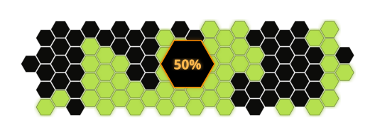

<div align="center">
  
</div>

<h1 align="center">A.T. Field Status</h1>

<p align="center">
  Générateur SVG de barre de progression hexagonale style <strong>A.T. Field</strong> (Evangelion).
  <br/>
  100 hexagones = 100 %, un par point de pourcentage.
</p>

<p align="center">
  
  
</p>

---

## Aperçu

```
atfield 42 > progress.svg
```

L'SVG généré contient :

- Une grille de **100 hexagones** disposés autour d'un hexagone central
- Les premiers **X hexagones** sont **verts** (progress rempli)
- Les **N suivants** pulsent en **orange** via CSS (en cours de charge)
- Le reste reste **noir** (non chargé)
- L'hexagone central affiche le **pourcentage** en police Orbitron
- Effet **neon glow** optionnel

---

## Installation

```bash
# Cloner le dépôt
git clone https://github.com/votre-user/atfield-status.git
cd atfield-status

# Créer l'environnement et installer
make venv
```

Ou avec pip :

```bash
pip install .
```

---

## Utilisation

### CLI

```bash
# Générer un SVG à 42 % sur stdout
atfield 42

# Écrire dans un fichier
atfield 42 -o progress.svg

# Personnaliser les couleurs
atfield 75 --filled "#00ff88" --charging "#ff6600" --empty "#111111"

# Désactiver le glow
atfield 50 --no-glow

# Ouvrir directement dans le navigateur (macOS)
make open ARGS=50
```

### Makefile

| Commande       | Description                        |
|----------------|------------------------------------|
| `make venv`    | Crée le venv et installe le package |
| `make test`    | Lance les tests                    |
| `make run ARGS=42` | Génère un SVG sur stdout        |
| `make open ARGS=50` | Génère et ouvre dans le navigateur |
| `make clean`   | Supprime le venv et les caches     |

---

## Options CLI

```
positional arguments:
  progress              Pourcentage (0-100)

options:
  -o, --output FILE     Fichier de sortie (stdout par défaut)
  --count COUNT         Nombre d'hexagones (défaut: 100)
  --radius RADIUS       Rayon des hexagones (défaut: 13)
  --gap GAP             Espacement entre hexagones (défaut: 0.08)
  --bg COLOR            Couleur de fond (défaut: #0a0a0f)
  --filled COLOR        Hexagones remplis (défaut: #b5e050)
  --charging COLOR      Hexagones en charge (défaut: #FF8C00)
  --empty COLOR         Hexagones vides (défaut: #0c0c0a)
  --stroke COLOR        Bordure hexagone central (défaut: #FF8C00)
  --stroke-width WIDTH  Épaisseur bordure (défaut: 1.5)
  --no-glow             Désactive l'effet neon
  --seed SEED           Grain aléatoire pour le remplissage (défaut: 1)
```

---

## Exemple

```bash
atfield 50 -o charging.svg
```

Résultat : 50 hexagones verts, 15 qui pulsent en orange (bande de charge), 35 noirs. L'hexagone central affiche « 50% » en amber avec glow.

<div align="center">
  
</div>

---

## Structure du projet

```
atfield-status/
├── src/atfield/
│   ├── __init__.py
│   ├── cli.py         # Point d'entrée CLI (argparse)
│   └── generator.py   # Générateur SVG (géométrie + CSS)
├── tests/
│   └── test_generator.py
├── Makefile
├── pyproject.toml
└── README.md
```

---

## Comment ça marche

1. **Géométrie** – Une grille d'hexagones `flat-top` est générée autour d'un centre. Les hexagones trop proches du centre sont retirés (pour laisser place à l'hexagone central).
2. **Placement organique** – Un bruit pseudo-aléatoire (`_noise_val`) détermine l'ordre de remplissage : chaque exécution avec la même `seed` produit le même motif.
3. **États** – Les hexagones sont triés par bruit, puis divisés en trois groupes : `filled`, `charging`, `empty`.
4. **CSS Animation** – Les hexagones `charging` reçoivent une animation `@keyframes charge` avec un délai progressif, créant une vague orange qui parcourt la bande de charge.
5. **Police Orbitron** – La typographie est chargée via `@font-face` depuis Google Fonts (woff2), pour un rendu fidèle même en local (file://).

---

## Personnalisation

Utilisez les flags CLI pour changer l'apparence :

```bash
# Thème cyberpunk
atfield 60 \
  --filled "#00ffcc" \
  --charging "#ff00ff" \
  --empty "#0a001a" \
  --stroke "#00ffcc" \
  --no-glow

# Petite grille pour badge
atfield 85 --count 30 --radius 8 -o badge.svg
```

---

## Licence

MIT
